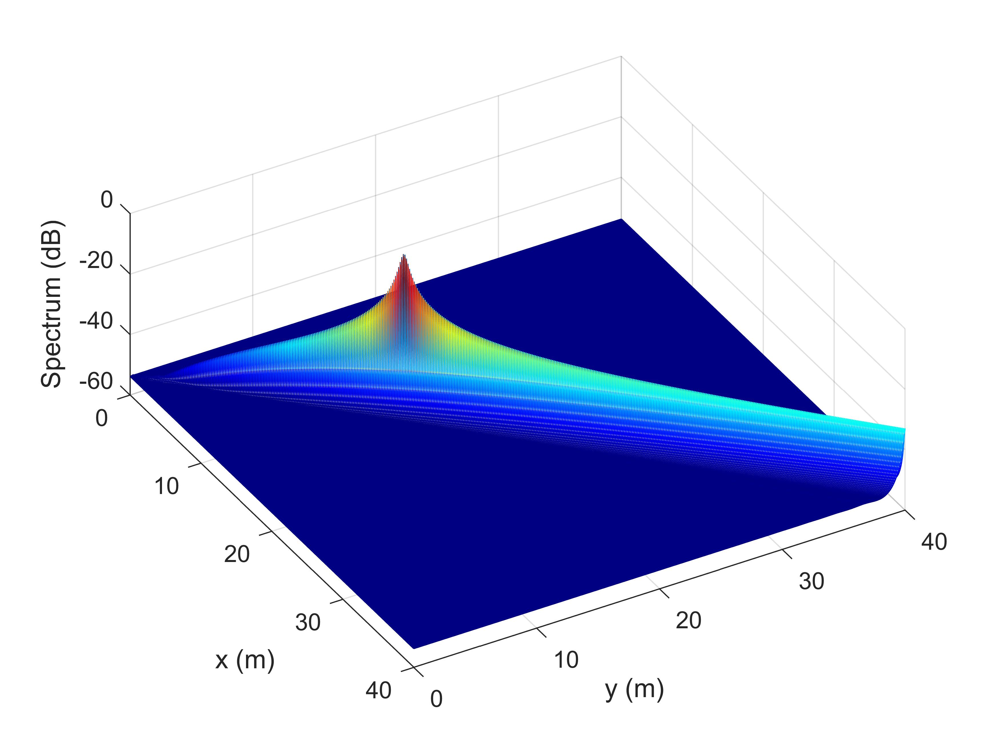

# Near-Field Integrated Sensing and Communications

The code for the papers 

**Z. Wang, X. Mu, and Y. Liu, “Near-Field Integrated Sensing and Communications,” *IEEE Commun. Lett.*, vol. 27, no. 8, pp. 2048-2052, Aug. 2023** [[IEEE](https://ieeexplore.ieee.org/abstract/document/10135096)] [[Arxiv](https://arxiv.org/abs/2302.01153)]


## Running the simulations

### Prerequisites

- [MATLAB](https://uk.mathworks.com/products/matlab.html)
- [CVX](http://cvxr.com/cvx/)

### Launch

Run `main.m`

### Expected Results

#### Spectrum of MUSIC


## Citing
If you in any way use this code for research, please cite our original articles listed above. The corresponding BiBTeX citation is given below:
```
@article{wang2023near,
  title={Near-field integrated sensing and communications},
  author={Wang, Zhaolin and Mu, Xidong and Liu, Yuanwei},
  journal={IEEE Wireless Commun. Lett.},
  year={2023},
  month=aug,
  volume={27},
  number={8},
  pages={2048-2052}
}
```
